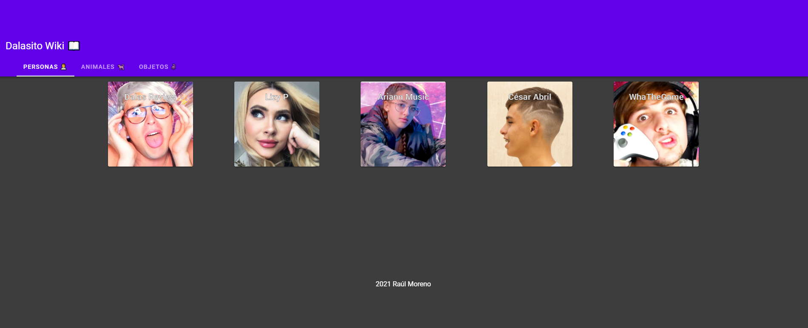
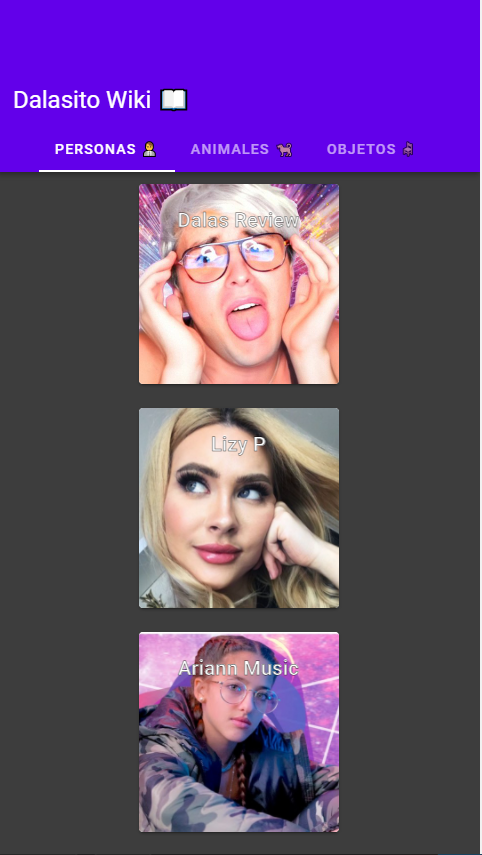

# dalasito-wiki
* Wiki de personajes que han aparecido en el canal, con fotos y una descripción de cada uno. Desarrollado en Vue.js
* Demostración en video del funcionamiento en PC: https://youtu.be/oaW3ms2p9U0


## Para ejecutar el proyecto, desde la terminal escribir los siguientes comandos en la ruta principal del proyecto:
```
* npm install
* npm run serve
```
La app es responsiva, por lo que se puede visualizar sin problema tanto en PC como en dispositivos moviles.



